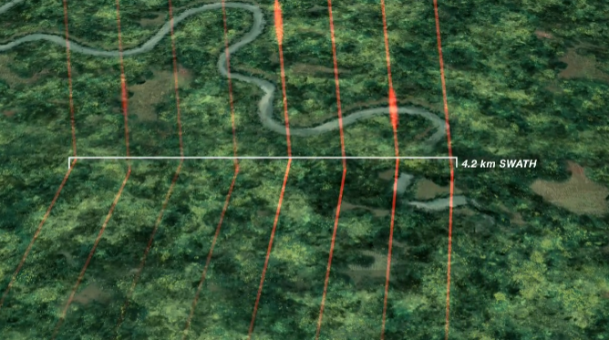

# Welcome

Hi, I'm **Dingjin Chu** — a researcher working at the intersection of **forest ecology, remote sensing, and geospatial data analysis**.

I use satellite imagery, cloud computing platforms, and statistical modeling to study forest disturbance and landscape change.

{.profile-img}

---

Connect with me:

